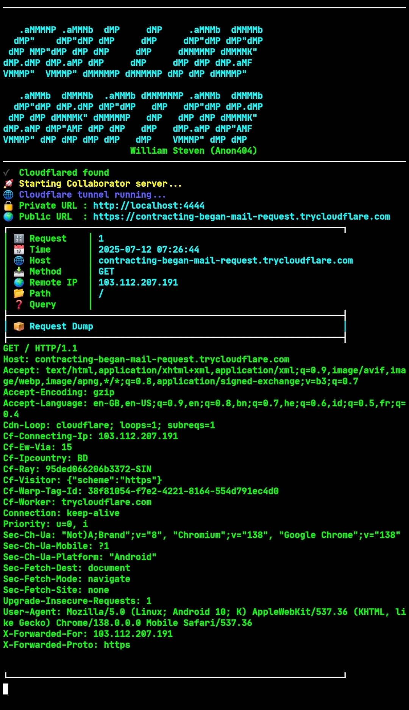

## 🚀 Features

- Captures all HTTP requests
- Live terminal logging with syntax-colored dump
- Built-in Cloudflare Tunnel support
- Clean and responsive UI for connection confirmation
- Stylish CLI output for better visualization
- Works on **Linux** and **Termux** environments

---

## 📦 Installation

### 🔧 Method 1: Clone and Run

```bash
git clone https://github.com/Anon-404/Gollaborator.git
cd Gollaborator
go run main.go
```

---

### ⚙️ Method 2: Go Install and Move Binary

✅ For Linux & Termux

```bash
go install github.com/Anon-404/Gollaborator@latest
cp $(go env GOPATH)/bin/Gollaborator $PREFIX/bin/
Gollaborator
```

> 🔁 Now you can run Gollaborator from anywhere in the terminal!

---

## 📸 Sample Output



---

## 🧠 Upcoming Modules

- DNS Request Logging (📡 under development)

- SMTP Trap (📩 coming soon)

- UI Panel for logs (Optional)

---

## 👨‍💻 Author

William Steven @Anon-404

🔗 Telegram: @Anon4004


---

## 📜 License

This project is licensed under the MIT License — feel free to use, modify, and share.


---

Happy Hacking 🐚
